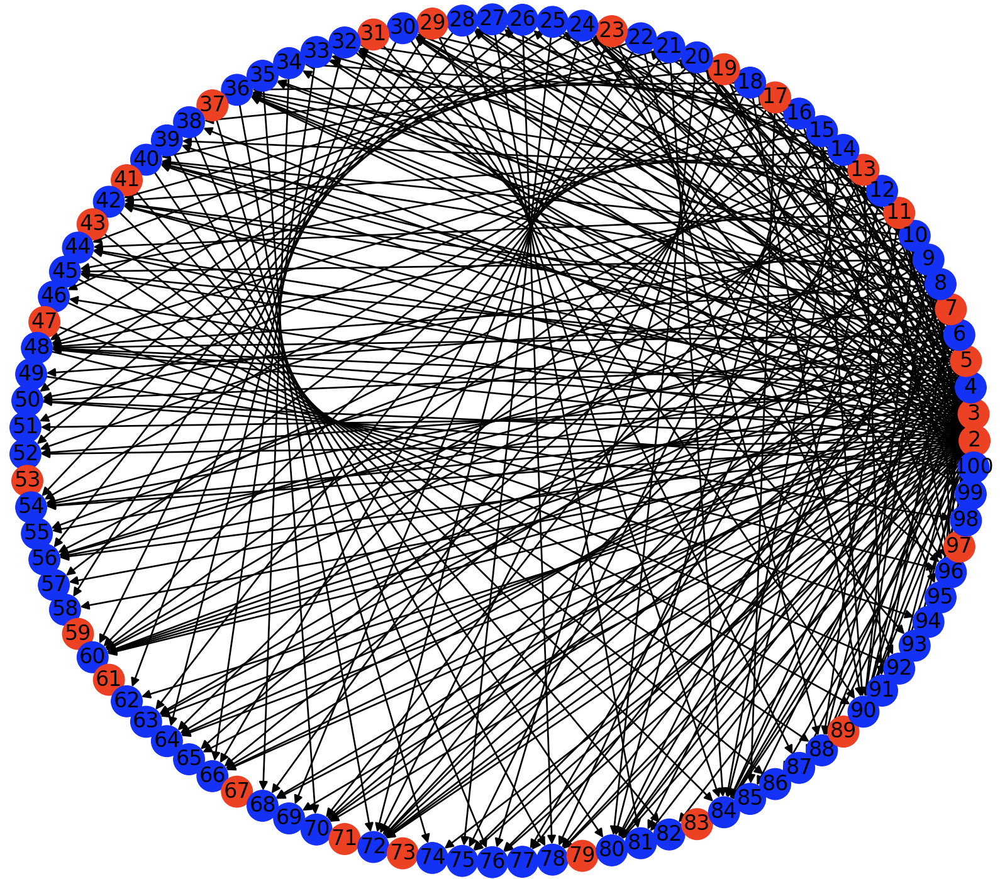

# Divisor graphs



It's a directed graph with 100 nodes (numbered from 1 to 100) pointed by its divisors.

## Code

```python
import networkx as nx
import matplotlib.pyplot as plt

DG = nx.DiGraph()
color_map = []

for i in range(2, 131):
    DG.add_node(i)

for i in range(2, 131):
    for j in range(2, i):
        if i % j == 0:
            DG.add_edge(j, i)

for node in DG.nodes():
    if DG.in_degree(node) == 0:
        color_map.append('red')
    else:
        color_map.append('blue')

nx.draw_circular(DG, with_labels=True, node_color=color_map)
plt.show()
```